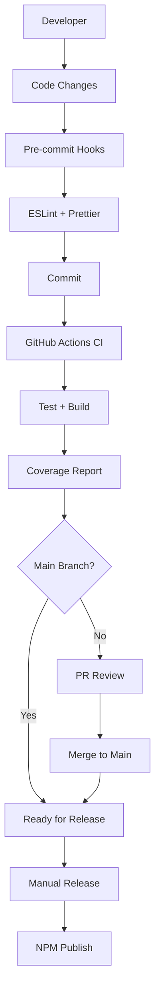

# HW-Utils

[](https://opensource.org/licenses/MIT)
[](https://github.com/troyciesco/hw-utils/actions)
[](https://codecov.io/gh/troyciesco/hw-utils)
[](https://nodejs.org/)
[](https://www.typescriptlang.org/)
[](https://lerna.js.org/)

A collection of utility packages for [Hedgewizard.dev](https://hedgewizard.dev), built with TypeScript and modern tooling.

## 📦 Packages

| Package | Version | Description | Status |
|---------|---------|-------------|--------|
| [@hw-utils/random-facts](./packages/random-facts) |  | Random dinosaur facts generator | ✅ Ready |

## 🚀 Quick Start

```bash
# Install a package
npm install @hw-utils/random-facts

# Or with yarn
yarn add @hw-utils/random-facts
```

### Usage Example

```typescript
import { getFact } from '@hw-utils/random-facts';

// Get a random dinosaur fact
const fact = getFact();
console.log(fact);
// "Tyrannosaurus rex had teeth up to 8 inches long, but they were shaped like bananas rather than sharp knives."

// Use in your application
function displayRandomFact() {
  const fact = getFact();
  document.getElementById('fact').textContent = fact;
}
```

## 🎮 Try the Demo

Experience the package in action with our interactive demo:

```bash
# Clone the repository
git clone https://github.com/troyciesco/hw-utils.git
cd hw-utils

# Install dependencies
yarn setup

# Run the demo
yarn demo
```

The demo will display multiple random dinosaur facts and showcase the package functionality.

## 🚀 Getting Started

### Prerequisites

- Node.js >= 18.0.0
- Yarn >= 1.22.0

### Installation

```bash
# Clone the repository
git clone https://github.com/troyciesco/hw-utils.git
cd hw-utils

# Install dependencies and bootstrap packages
yarn setup
```

### Development

```bash
# Run tests across all packages
yarn test

# Lint all packages
yarn lint

# Build all packages
yarn build

# Clean node_modules across all packages
yarn clean

# Run demo script
yarn demo
```

## 🏗️ Monorepo Architecture

This monorepo is managed using [Lerna](https://lerna.js.org/) with [Yarn Workspaces](https://classic.yarnpkg.com/en/docs/workspaces/) in independent versioning mode.

### 📁 Directory Structure

```
hw-utils/
├── .github/
│   └── workflows/             # GitHub Actions CI/CD
├── packages/
│   └── random-facts/          # @hw-utils/random-facts package
│       ├── src/
│       │   ├── index.ts       # Main export
│       │   └── facts.ts       # Dinosaur facts data
│       ├── __tests__/         # Vitest tests
│       ├── package.json       # Package configuration
│       └── README.md          # Package documentation
├── examples/                  # Usage examples and demos
│   └── quick-demo.ts         # Demo script for random-facts
├── .husky/                    # Git hooks
├── package.json              # Root package configuration
├── lerna.json                # Lerna configuration
├── tsconfig.json             # TypeScript configuration
├── vitest.config.ts          # Test configuration
├── .eslintrc.js              # ESLint configuration
├── .prettierrc.js            # Prettier configuration
├── .editorconfig             # Editor configuration
└── README.md                 # This file
```

### 🔧 Technology Stack

- **Package Manager**: [Lerna](https://lerna.js.org/) 6.6.2 + [Yarn Workspaces](https://classic.yarnpkg.com/en/docs/workspaces/)
- **Language**: [TypeScript](https://www.typescriptlang.org/) 5.x
- **Testing**: [Vitest](https://vitest.dev/) with coverage reporting
- **Linting**: [ESLint](https://eslint.org/) with [Airbnb](https://github.com/airbnb/javascript) configuration
- **Formatting**: [Prettier](https://prettier.io/) with [lint-staged](https://github.com/okonet/lint-staged)
- **CI/CD**: [GitHub Actions](https://github.com/features/actions) with automated testing and publishing
- **Git Hooks**: [Husky](https://typicode.github.io/husky/) for pre-commit validation

### 📊 Workflow



## 📝 License

MIT © [Hedgewizard.dev](https://hedgewizard.dev)

## 🛠️ Adding New Packages

To add a new utility package to the monorepo:

1. **Create package directory**:
   ```bash
   mkdir packages/your-package-name
   cd packages/your-package-name
   ```

2. **Initialize package.json**:
   ```json
   {
     "name": "@hw-utils/your-package-name",
     "version": "1.0.0",
     "description": "Your package description",
     "main": "dist/index.js",
     "types": "dist/index.d.ts",
     "scripts": {
       "build": "tsc",
       "test": "vitest run"
     }
   }
   ```

3. **Create TypeScript source**:
   ```bash
   mkdir src __tests__
   echo "export function yourFunction() { return 'Hello World'; }" > src/index.ts
   ```

4. **Add tests**:
   ```bash
   echo "import { yourFunction } from '../src/index';" > __tests__/index.test.ts
   ```

5. **Bootstrap and build**:
   ```bash
   cd ../..
   yarn bootstrap
   yarn build
   ```

## 🤝 Contributing

Contributions are welcome! Here's how to get started:

### Development Setup

1. **Clone and install**:
   ```bash
   git clone https://github.com/troyciesco/hw-utils.git
   cd hw-utils
   yarn setup
   ```

2. **Run tests**:
   ```bash
   yarn test
   ```

3. **Format and lint**:
   ```bash
   yarn lint
   yarn format
   ```

### Guidelines

- Follow [Conventional Commits](https://www.conventionalcommits.org/)
- Write comprehensive tests for new features
- Update documentation for any API changes
- Ensure all CI checks pass before submitting PRs

### Code Style

- **TypeScript**: All code must be written in TypeScript
- **ESLint**: Follow Airbnb configuration
- **Prettier**: Auto-formatted on commit
- **Tests**: Use Vitest for all testing

For more details, please read our [Contributing Guide](CONTRIBUTING.md). 